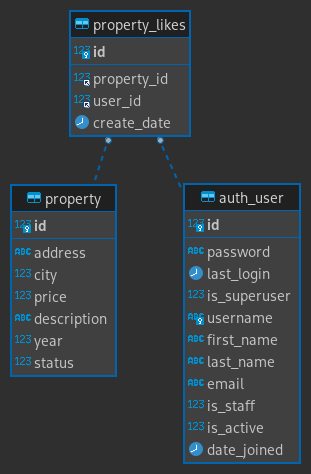

# API Test


#### ***Tecnologías***
- Docker (python:3.10.4-alpine3.16)
- Python (requests, urllib3, mysql-connector, dicttoxml, xmltodict)
---


#### ***Plan de trabajo***
- Reconocimiento del problema
- Conocer las entradas y salidas
- Creación de pruebas
- Creación de API
- Validación de pruebas y refactorizar de ser necesario
---


#### ***Endpoints***
- /realEstates/`{id}`?status=`{estado}`&year=`{año}`&city=`{ciudad}`
	```bash
	curl -i -X GET http://127.0.0.1:5000/realEstates/\?status=pre_venta\&year=2020\&city=bogota
	```

- /realEstates/`{*id}`/Likes
	```bash
	curl -i -X POST -H "Authorization: Basic {BASE64 USER}" http://127.0.0.1:5000/realEstates/1/Likes
	```

> Los parámetros marcados con * son obligatorios, todos los demás son opcionales
---

#### ***Deploy***
Configura las credenciales de la base de datos en el archivo `.env`
```.env
DB_HOST=
DB_DATABASE=
DB_USER=
DB_PASS=
DB_PORT=
```

Para ejecutar la API utiliza el siguiente comando, en caso de querer ejecutar las pruebas de los endpoints agrega al final del comando ```-t``` o ```--test```
```bash
docker run --rm --env-file .env -p 5000:5000 -it $(docker build -q .)
# O ejecute el siguiente comando
# docker compose up -d
```
---


#### ***DB***
- Se crea la tabla de `property_likes` para el manejo del me gusta de los usuarios, no creo una llave única del usuario con la propiedad para que el usuario le puede darle me gusta más de una vez



> Esta tabla fue creada para el endpoint /realEstates/`{*id}`/Likes

```sql
CREATE TABLE `property_likes` (
  `id` int(11) NOT NULL AUTO_INCREMENT,
  `property_id` int(11) NOT NULL,
  `user_id` int(11) NOT NULL,
  `create_date` datetime NOT NULL DEFAULT CURRENT_TIMESTAMP,
  PRIMARY KEY (`id`),
  CONSTRAINT `property_likes_property_id_fk` FOREIGN KEY (`property_id`) REFERENCES `property` (`id`),
  CONSTRAINT `property_likes_user_id_fk` FOREIGN KEY (`user_id`) REFERENCES `auth_user` (`id`)
) ENGINE=InnoDB
DEFAULT CHARSET=latin1;
```

- Mejoras sugeridas a la base de datos:
	- En la tabla de property  normalizar la columna city, year
		```sql
		CREATE TABLE `property_city` (
			`id` int(11) NOT NULL AUTO_INCREMENT,
			`name` varchar(32) NOT NULL,
			PRIMARY KEY (`id`)
		) ENGINE=InnoDB DEFAULT CHARSET=latin1
		AS
		SELECT NULL AS id, city AS name
		FROM property
		WHERE city!=''
		GROUP BY 2
		ORDER BY 2 ASC;

		ALTER TABLE `property` MODIFY COLUMN city varchar(32) CHARACTER SET latin1 COLLATE latin1_swedish_ci DEFAULT NULL NULL;

		CREATE TABLE `property_year` (
			`id` int(11) NOT NULL AUTO_INCREMENT,
			`year` int(4) NOT NULL,
			PRIMARY KEY (`id`)
		) ENGINE=InnoDB DEFAULT CHARSET=latin1
		AS
		SELECT NULL AS id, `year`
		FROM property
		WHERE `year` IS NOT NULL
		GROUP BY 2
		ORDER BY 2 ASC;

		UPDATE `property` p LEFT JOIN `property_city` pc ON p.city = pc.name SET p.city = pc.id;
		UPDATE `property` p INNER JOIN `property_year` py ON p.`year` = py.`year` SET p.`year` = py.id;

		ALTER TABLE `property` MODIFY COLUMN city INT(11) NULL;
		```
	- En la tabla de property agregar columna status y asi dejar la tabla status_history solo para consulta del historial
		```sql
		ALTER TABLE `property` ADD status int(11) NULL;

		UPDATE property p
		INNER JOIN (
			SELECT property_id, status_id
			FROM (
				SELECT a.*,
				@r := CASE
					WHEN a.property_id = @prevcol THEN @r + 1
					WHEN (@prevcol := a.property_id) = null THEN null
					ELSE 1 END AS rn
				FROM (
					SELECT id, property_id, status_id
					FROM status_history
					ORDER BY property_id, id DESC
					LIMIT 18446744073709551615
				) a,
				(SELECT @r := 0, @prevcol := null) X
				ORDER BY a.property_id, a.id DESC
			) a
			WHERE a.rn=1
		) sh ON p.id=sh.property_id
		INNER JOIN `status` s ON sh.status_id=s.id
		SET p.status = s.id;
		```
	- En la tabla auth_user la columna password se debe encriptar para cumplir con la norma
